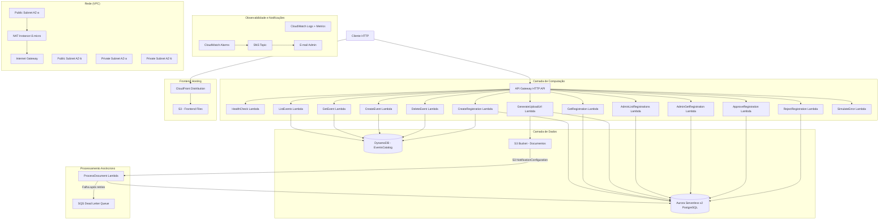
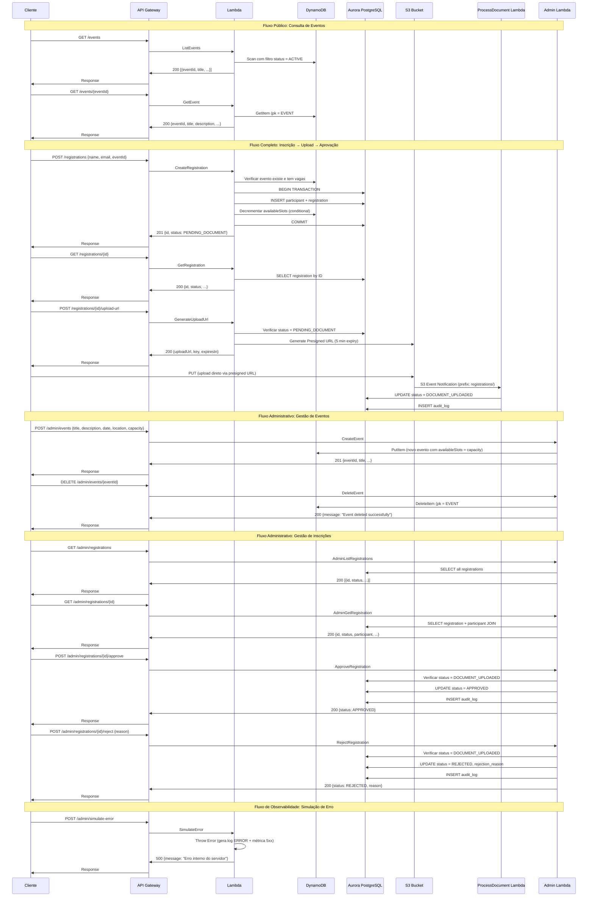
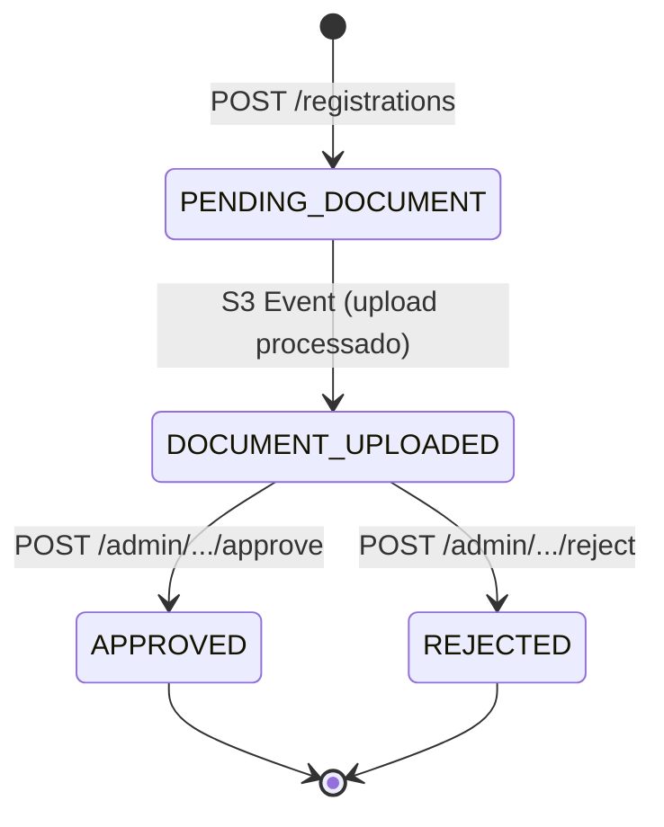
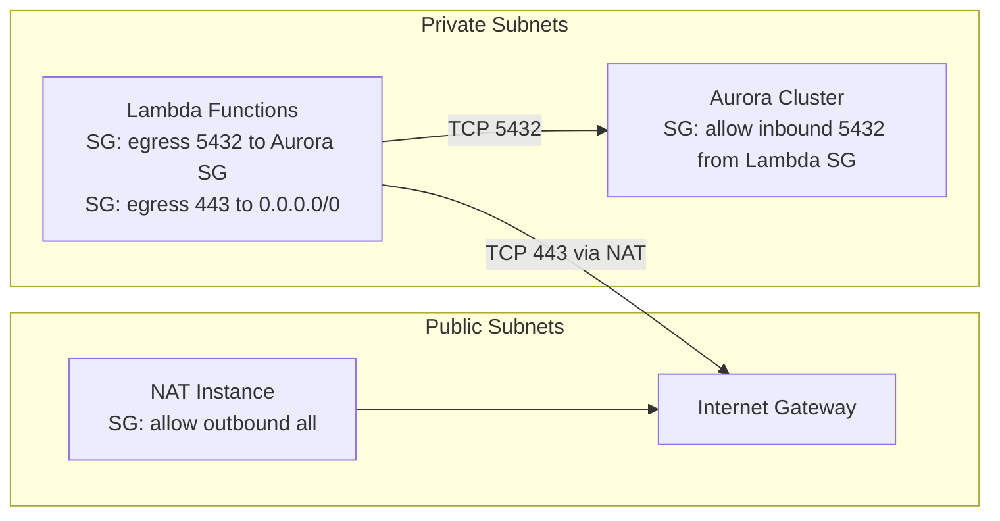
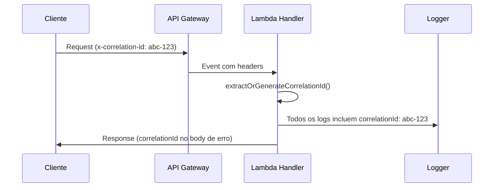

# Design Document — EventHub Webinar

## Overview

O EventHub Serverless é uma plataforma de gestão de eventos e inscrições construída com serviços AWS serverless. O sistema segue uma arquitetura orientada a eventos com API Gateway HTTP como ponto de entrada, funções Lambda para lógica de negócio, DynamoDB para catálogo de eventos (leituras rápidas por chave), Aurora Serverless v2 PostgreSQL para inscrições (transações ACID, JOINs) e S3 para armazenamento de documentos com processamento assíncrono.

A infraestrutura é definida como código usando AWS SAM com TypeScript e esbuild para bundling. Lambda Powertools é utilizado via Layer para observabilidade (logging estruturado, tracing, métricas). A rede utiliza VPC com subnets públicas/privadas e NAT Instance (otimização de custo) para permitir que Lambdas na VPC acessem a internet.

### IMPORTANTE — Restrições Técnicas para Evitar Erros de Build

1. **Runtime Node.js**: Utilizar `nodejs22.x` em Globals e no Lambda Layer (BuildMethod). O runtime `nodejs20.x` está deprecated desde 2026-04-30 e causa warnings/erros no `sam validate --lint`.
2. **S3 Event Notification — Evitar Dependência Circular COMPLETA**: A dependência circular ocorre quando `DocumentsBucket` referencia `ProcessUploadedDocumentFunction` (via NotificationConfiguration) E `ProcessUploadedDocumentFunction` referencia `DocumentsBucket` (via S3ReadPolicy, S3CrudPolicy ou variável de ambiente com `!Ref DocumentsBucket`). Para quebrar o ciclo:
   - **NÃO usar `!Ref DocumentsBucket`** em nenhum lugar da `ProcessUploadedDocumentFunction` (nem em Policies, nem em Environment Variables)
   - **NÃO usar `S3ReadPolicy` ou `S3CrudPolicy` com `!Ref DocumentsBucket`** na ProcessUploadedDocumentFunction
   - Em vez disso, usar o nome do bucket hardcoded via `!Sub "${AWS::StackName}-documents-${AWS::AccountId}"` nas variáveis de ambiente
   - Para permissões S3, usar uma policy inline com `!Sub "arn:aws:s3:::${AWS::StackName}-documents-${AWS::AccountId}/*"` em vez de SAM policy templates que referenciam o bucket
   - A notificação S3 deve ser configurada diretamente no `DocumentsBucket` usando `NotificationConfiguration` com `LambdaConfigurations`
   - Criar `AWS::Lambda::Permission` separado para permitir que S3 invoque a Lambda
   - O mesmo se aplica à `GenerateUploadUrlFunction`: usar `!Sub` para o nome do bucket em vez de `!Ref DocumentsBucket` nas variáveis de ambiente, e policy inline para S3 em vez de `S3CrudPolicy`
3. **Lambda Layer BuildMethod**: Deve ser `nodejs22.x` (mesmo valor do runtime global).
4. **Alarmes CloudWatch**: O `ApiGateway5xxAlarm` NÃO deve referenciar `!Ref EventHubApi` se isso criar ciclo com as permissions do API Gateway. Usar `!Sub` com o API ID se necessário, ou definir o alarme sem Dimensions específicas do API (usar métrica agregada).
5. **NAT Instance — Usar fck-nat**: NÃO usar AMI genérica com UserData manual para configurar NAT. Usar a AMI **fck-nat** (owner `568608671756`, baseada em Amazon Linux 2023) que configura ip_forward e iptables automaticamente. Sem UserData necessário. Apenas definir SourceDestCheck: false e associar Elastic IP. Para obter o AMI: `aws ec2 describe-images --owners 568608671756 --filters 'Name=name,Values=fck-nat-al2023-*-x86_64*' --query 'Images | sort_by(@, &CreationDate) | [-1].ImageId' --output text`
6. **Lambda Security Group — Egress HTTPS obrigatório**: Quando se adiciona um `AWS::EC2::SecurityGroupEgress` explícito (ex: para Aurora 5432), o AWS REMOVE a regra default "allow all outbound". Portanto, DEVE-SE adicionar um segundo SecurityGroupEgress permitindo TCP 443 para 0.0.0.0/0. Sem isso, Lambdas na VPC não conseguem acessar DynamoDB, S3, Secrets Manager ou qualquer serviço AWS (que usam HTTPS/443 via NAT).
7. **Aurora Password via Secrets Manager**: Como o Aurora usa `ManageMasterUserPassword: true`, a senha é armazenada no Secrets Manager (NÃO em variável de ambiente). O repository PostgreSQL DEVE:
   - Usar lazy initialization do Pool (`getPool()` assíncrona)
   - Buscar a senha via `GetSecretValueCommand` usando `DB_SECRET_ARN`
   - Parsear o JSON retornado (`{ password: "..." }`)
   - Todas as funções Lambda que acessam Aurora DEVEM ter:
     - Env var `DB_SECRET_ARN: !GetAtt AuroraCluster.MasterUserSecret.SecretArn`
     - Policy inline: `secretsmanager:GetSecretValue` no Resource `!GetAtt AuroraCluster.MasterUserSecret.SecretArn`
   - Instalar `@aws-sdk/client-secrets-manager` como dependência do projeto
8. **S3 CORS para Presigned URL Uploads**: O `DocumentsBucket` DEVE ter `CorsConfiguration` com `CorsRules` permitindo método PUT de qualquer origem (*) com quaisquer headers (*) e MaxAge 3600. Sem isso, uploads via presigned URL falham com erro CORS no browser.

## Architecture

### Diagrama de Arquitetura de Alto Nível



### Fluxo de Dados Principal



## Components and Interfaces

### Estrutura de Pastas do Projeto

```
eventhub-serverless/
├── template.yaml                    # SAM template principal
├── samconfig.toml                   # Configurações de deploy
├── package.json
├── tsconfig.json
├── frontend/                        # UI estática (Alpine.js + Pico.css)
│   ├── index.html                   # Página pública (eventos, inscrições, upload)
│   ├── admin.html                   # Painel administrativo
│   └── app.js                       # Lógica compartilhada (API client, componentes)
├── src/
│   ├── handlers/                    # Entry points das Lambdas
│   │   ├── health.ts
│   │   ├── list-events.ts
│   │   ├── get-event.ts
│   │   ├── create-event.ts
│   │   ├── delete-event.ts
│   │   ├── create-registration.ts
│   │   ├── get-registration.ts
│   │   ├── generate-upload-url.ts
│   │   ├── process-uploaded-document.ts
│   │   ├── admin-list-registrations.ts
│   │   ├── admin-get-registration.ts
│   │   ├── approve-registration.ts
│   │   ├── reject-registration.ts
│   │   └── simulate-error.ts
│   ├── services/                    # Lógica de negócio
│   │   ├── event-service.ts
│   │   ├── registration-service.ts
│   │   └── document-service.ts
│   ├── repositories/                # Acesso a dados (Repository Pattern)
│   │   ├── interfaces/
│   │   │   ├── event-repository.ts
│   │   │   └── registration-repository.ts
│   │   ├── dynamo-event-repository.ts
│   │   └── aurora-registration-repository.ts
│   ├── shared/                      # Utilitários compartilhados
│   │   ├── logger.ts               # Wrapper Lambda Powertools Logger
│   │   ├── correlation-id.ts       # Middleware correlation ID
│   │   ├── response.ts             # Response builder padronizado
│   │   ├── validator.ts            # Validação de inputs
│   │   └── errors.ts               # Classes de erro customizadas
│   └── types/                       # Interfaces e tipos TypeScript
│       ├── event.ts
│       ├── registration.ts
│       ├── participant.ts
│       └── api.ts
├── sql/
│   └── schema.sql                   # Schema do Aurora PostgreSQL
├── scripts/
│   ├── seed-events.ts               # Popular DynamoDB com eventos
│   ├── apply-schema.ts              # Aplicar schema SQL no Aurora via Data API
│   └── demo-api.sh                  # Script de demonstração interativo dos endpoints
├── layers/
│   └── powertools/
│       └── package.json             # Dependências do Lambda Layer (Powertools)
└── tests/
    ├── unit/
    └── property/
```

### Contratos da API

#### Endpoints Públicos

| Método | Path | Handler | Descrição |
|--------|------|---------|-----------|
| GET | /health | health | Health check |
| GET | /events | list-events | Listar eventos ativos |
| GET | /events/{eventId} | get-event | Detalhes de um evento |
| POST | /registrations | create-registration | Criar inscrição |
| GET | /registrations/{id} | get-registration | Status da inscrição |
| POST | /registrations/{id}/upload-url | generate-upload-url | Gerar URL de upload |

#### Endpoints Administrativos

| Método | Path | Handler | Descrição |
|--------|------|---------|-----------|
| GET | /admin/registrations | admin-list-registrations | Listar todas inscrições |
| GET | /admin/registrations/{id} | admin-get-registration | Detalhes da inscrição |
| POST | /admin/registrations/{id}/approve | approve-registration | Aprovar inscrição |
| POST | /admin/registrations/{id}/reject | reject-registration | Rejeitar inscrição |
| POST | /admin/events | create-event | Criar novo evento |
| DELETE | /admin/events/{eventId} | delete-event | Excluir evento |
| POST | /admin/simulate-error | simulate-error | Simular erro 5xx |

### Interfaces TypeScript Principais

```typescript
// src/types/event.ts
interface Event {
  eventId: string;
  title: string;
  description: string;
  date: string;          // ISO 8601
  location: string;
  capacity: number;
  availableSlots: number;
  status: 'ACTIVE' | 'INACTIVE';
}

// src/types/registration.ts
type RegistrationStatus = 'PENDING_DOCUMENT' | 'DOCUMENT_UPLOADED' | 'APPROVED' | 'REJECTED';

interface Registration {
  id: string;            // UUID
  participantId: string; // UUID
  eventId: string;
  status: RegistrationStatus;
  documentS3Key?: string;
  rejectionReason?: string;
  createdAt: string;     // ISO 8601
  updatedAt: string;     // ISO 8601
}

// src/types/participant.ts
interface Participant {
  id: string;            // UUID
  name: string;
  email: string;
  createdAt: string;     // ISO 8601
}

// src/types/api.ts
interface ApiErrorResponse {
  statusCode: number;
  message: string;
  correlationId: string;
}

interface UploadUrlResponse {
  uploadUrl: string;
  key: string;
  expiresIn: number;     // segundos
}

interface CreateRegistrationRequest {
  name: string;
  email: string;
  eventId: string;
}

interface RejectRegistrationRequest {
  reason: string;
}
```

### Interfaces de Repository

```typescript
// src/repositories/interfaces/event-repository.ts
interface EventRepository {
  listActiveEvents(): Promise<Event[]>;
  getEventById(eventId: string): Promise<Event | null>;
  decrementAvailableSlots(eventId: string): Promise<boolean>;
  createEvent(event: Event): Promise<Event>;
  deleteEvent(eventId: string): Promise<boolean>;
}

// src/repositories/interfaces/registration-repository.ts
interface RegistrationRepository {
  createParticipantAndRegistration(
    participant: Omit<Participant, 'id' | 'createdAt'>,
    eventId: string
  ): Promise<{ participant: Participant; registration: Registration }>;
  getRegistrationById(id: string): Promise<Registration | null>;
  getRegistrationWithParticipant(id: string): Promise<(Registration & { participant: Participant }) | null>;
  listAllRegistrations(): Promise<Registration[]>;
  updateStatus(id: string, newStatus: RegistrationStatus, reason?: string): Promise<Registration>;
  findByEmailAndEvent(email: string, eventId: string): Promise<Registration | null>;
  createAuditLog(registrationId: string, oldStatus: string, newStatus: string, reason?: string): Promise<void>;
}
```

### Módulo de Validação

```typescript
// src/shared/validator.ts
interface ValidationResult {
  isValid: boolean;
  errors: string[];
}

function validateCreateRegistration(body: unknown): ValidationResult;
function validateUploadUrlRequest(body: unknown): ValidationResult;
function validateRejectRequest(body: unknown): ValidationResult;
function validateEventId(eventId: string): ValidationResult;
function validateRegistrationId(id: string): ValidationResult;
function validateFileName(fileName: string): ValidationResult;
function validateContentType(contentType: string): ValidationResult;
```

### Módulo de Resposta Padronizada

```typescript
// src/shared/response.ts
function success(statusCode: number, body: unknown): APIGatewayProxyResult;
function error(statusCode: number, message: string, correlationId: string): APIGatewayProxyResult;
```

### Módulo de Correlation ID

```typescript
// src/shared/correlation-id.ts
function extractOrGenerateCorrelationId(event: APIGatewayProxyEventV2): string;
```

### Geração de Chave S3

```typescript
// src/services/document-service.ts
function generateS3Key(registrationId: string, fileName: string): string;
// Formato: "registrations/{registrationId}/{fileName}"

function extractRegistrationIdFromS3Key(key: string): string;
// Extrai registrationId de "registrations/{registrationId}/{fileName}"
```

## Data Models

### DynamoDB — EventsCatalogTable

**Configuração:**
- Partition Key: `pk` (String)
- Billing Mode: PAY_PER_REQUEST
- Point-in-Time Recovery: Habilitado
- Criptografia: Em repouso (AWS managed key)

**Schema do Item:**

| Atributo | Tipo | Formato | Descrição |
|----------|------|---------|-----------|
| pk | String | `EVENT#{eventId}` | Partition key |
| eventId | String | UUID v4 | Identificador único do evento |
| title | String | max 255 chars | Título do evento |
| description | String | max 5000 chars | Descrição detalhada |
| date | String | ISO 8601 | Data do evento |
| location | String | max 255 chars | Local do evento |
| capacity | Number | > 0 | Capacidade total |
| availableSlots | Number | >= 0 | Vagas disponíveis |
| status | String | ACTIVE \| INACTIVE | Status do evento |

**Operação Condicional para Decremento:**
```
UpdateExpression: SET availableSlots = availableSlots - 1
ConditionExpression: availableSlots > 0
```

### Aurora Serverless v2 PostgreSQL — Schema SQL

**Configuração do Cluster:**
- Engine: Aurora PostgreSQL (compatível com PostgreSQL 15)
- Capacidade: 0.5 ACU (mínimo) — 2 ACUs (máximo)
- Subnets: Private subnets da VPC
- Criptografia: Em repouso habilitada
- Credenciais: AWS Secrets Manager

```sql
-- Tabela de participantes
CREATE TABLE participants (
    id UUID PRIMARY KEY DEFAULT gen_random_uuid(),
    name VARCHAR(150) NOT NULL,
    email VARCHAR(254) NOT NULL,
    created_at TIMESTAMP WITH TIME ZONE DEFAULT NOW(),
    CONSTRAINT uq_participant_email UNIQUE (email)
);

-- Tabela de inscrições
CREATE TABLE registrations (
    id UUID PRIMARY KEY DEFAULT gen_random_uuid(),
    participant_id UUID NOT NULL REFERENCES participants(id),
    event_id VARCHAR(255) NOT NULL,
    status VARCHAR(50) NOT NULL DEFAULT 'PENDING_DOCUMENT',
    document_s3_key VARCHAR(500),
    rejection_reason VARCHAR(500),
    created_at TIMESTAMP WITH TIME ZONE DEFAULT NOW(),
    updated_at TIMESTAMP WITH TIME ZONE DEFAULT NOW(),
    CONSTRAINT chk_status CHECK (status IN ('PENDING_DOCUMENT', 'DOCUMENT_UPLOADED', 'APPROVED', 'REJECTED')),
    CONSTRAINT uq_participant_event UNIQUE (participant_id, event_id)
);

-- Índice para busca por evento
CREATE INDEX idx_registrations_event_id ON registrations(event_id);

-- Índice para busca por status
CREATE INDEX idx_registrations_status ON registrations(status);

-- Tabela de audit logs
CREATE TABLE registration_audit_logs (
    id UUID PRIMARY KEY DEFAULT gen_random_uuid(),
    registration_id UUID NOT NULL REFERENCES registrations(id),
    old_status VARCHAR(50),
    new_status VARCHAR(50) NOT NULL,
    reason VARCHAR(500),
    created_at TIMESTAMP WITH TIME ZONE DEFAULT NOW()
);

-- Índice para busca por inscrição
CREATE INDEX idx_audit_logs_registration_id ON registration_audit_logs(registration_id);
```

### Máquina de Estados da Inscrição



**Transições Válidas:**
| Estado Atual | Estado Destino | Trigger |
|---|---|---|
| PENDING_DOCUMENT | DOCUMENT_UPLOADED | Processamento de upload S3 |
| DOCUMENT_UPLOADED | APPROVED | Ação administrativa |
| DOCUMENT_UPLOADED | REJECTED | Ação administrativa |

### Estrutura do Template SAM (template.yaml)

```yaml
# Organização lógica do template.yaml
AWSTemplateFormatVersion: '2010-09-09'
Transform: AWS::Serverless-2016-10-31

Globals:
  Function:
    Runtime: nodejs22.x
    Timeout: 30
    MemorySize: 256
    Tracing: Active
    Tags:
      Project: EventHub
      Environment: Workshop

Parameters:
  AdminEmail:
    Type: String
    Description: E-mail do administrador para notificações
  NATInstanceAMI:
    Type: AWS::EC2::Image::Id
    Description: AMI ID do fck-nat para a região de deploy

Resources:
  # --- API Gateway ---
  EventHubApi:
    Type: AWS::Serverless::HttpApi

  # --- Lambda Layer (Powertools) ---
  PowertoolsLayer:
    Type: AWS::Serverless::LayerVersion
    # BuildMethod: nodejs22.x (deve coincidir com o runtime global)

  # --- DynamoDB ---
  EventsCatalogTable:
    Type: AWS::DynamoDB::Table

  # --- VPC ---
  EventHubVPC:
    Type: AWS::EC2::VPC
  PublicSubnet1/2:
    Type: AWS::EC2::Subnet
  PrivateSubnet1/2:
    Type: AWS::EC2::Subnet
  InternetGateway:
    Type: AWS::EC2::InternetGateway
  NATInstance:
    Type: AWS::EC2::Instance
  # Route Tables, Security Groups...

  # --- Aurora Serverless ---
  AuroraCluster:
    Type: AWS::RDS::DBCluster
  AuroraInstance:
    Type: AWS::RDS::DBInstance
  DBSubnetGroup:
    Type: AWS::RDS::DBSubnetGroup

  # --- S3 ---
  DocumentsLogsBucket:
    Type: AWS::S3::Bucket
    # Bucket de logs para S3 access logging (cfn-guard requirement)

  DocumentsBucket:
    Type: AWS::S3::Bucket
    # IMPORTANTE: Definido APÓS ProcessUploadedDocumentFunction para evitar dependência circular
    # DependsOn garante que a Permission existe antes da NotificationConfiguration
    DependsOn: ProcessUploadedDocumentS3Permission
    Properties:
      BucketName: !Sub "${AWS::StackName}-documents-${AWS::AccountId}"
      VersioningConfiguration:
        Status: Enabled
      LoggingConfiguration:
        DestinationBucketName: !Ref DocumentsLogsBucket
      NotificationConfiguration:
        LambdaConfigurations:
          - Event: s3:ObjectCreated:*
            Function: !GetAtt ProcessUploadedDocumentFunction.Arn
            Filter:
              S3Key:
                Rules:
                  - Name: prefix
                    Value: registrations/

  # Permissão para S3 invocar a Lambda (SourceArn via !Sub, NÃO !GetAtt DocumentsBucket.Arn)
  ProcessUploadedDocumentS3Permission:
    Type: AWS::Lambda::Permission
    Properties:
      FunctionName: !Ref ProcessUploadedDocumentFunction
      Action: lambda:InvokeFunction
      Principal: s3.amazonaws.com
      SourceArn: !Sub "arn:aws:s3:::${AWS::StackName}-documents-${AWS::AccountId}"
      SourceAccount: !Ref AWS::AccountId

  # --- SQS (DLQ) ---
  ProcessDocumentDLQ:
    Type: AWS::SQS::Queue

  # --- SNS ---
  AlarmNotificationTopic:
    Type: AWS::SNS::Topic
  AlarmEmailSubscription:
    Type: AWS::SNS::Subscription

  # --- CloudWatch Alarms ---
  ApiGateway5xxAlarm:
    Type: AWS::CloudWatch::Alarm
  DLQMessagesAlarm:
    Type: AWS::CloudWatch::Alarm
  ProcessDocumentErrorsAlarm:
    Type: AWS::CloudWatch::Alarm

  # --- Lambda Functions ---
  HealthFunction:
    Type: AWS::Serverless::Function
  ListEventsFunction:
    Type: AWS::Serverless::Function
  GetEventFunction:
    Type: AWS::Serverless::Function
  CreateRegistrationFunction:
    Type: AWS::Serverless::Function
  GetRegistrationFunction:
    Type: AWS::Serverless::Function
  GenerateUploadUrlFunction:
    Type: AWS::Serverless::Function
  ProcessUploadedDocumentFunction:
    Type: AWS::Serverless::Function
    # NOTA: NÃO definir Events S3 aqui — a notificação é configurada no DocumentsBucket
    # para evitar dependência circular. Usar EventInvokeConfig para DLQ.
  AdminListRegistrationsFunction:
    Type: AWS::Serverless::Function
  AdminGetRegistrationFunction:
    Type: AWS::Serverless::Function
  ApproveRegistrationFunction:
    Type: AWS::Serverless::Function
  RejectRegistrationFunction:
    Type: AWS::Serverless::Function
  SimulateErrorFunction:
    Type: AWS::Serverless::Function

Outputs:
  ApiUrl:
    Value: !Sub "https://${EventHubApi}.execute-api.${AWS::Region}.amazonaws.com"
```

### Design de Segurança

#### IAM — Princípio de Menor Privilégio

Cada função Lambda recebe apenas as permissões necessárias via SAM Policy Templates:

| Função | Policies |
|--------|----------|
| ListEvents / GetEvent | DynamoDBReadPolicy (EventsCatalogTable) |
| CreateEvent | DynamoDBCrudPolicy (EventsCatalogTable) |
| DeleteEvent | DynamoDBCrudPolicy (EventsCatalogTable) |
| CreateRegistration | DynamoDBCrudPolicy (EventsCatalogTable) + VPCAccessPolicy |
| GenerateUploadUrl | Inline S3 policy via !Sub ARN (NÃO S3CrudPolicy com !Ref) + VPCAccessPolicy |
| ProcessUploadedDocument | Inline S3 read policy via !Sub ARN (NÃO S3ReadPolicy com !Ref) + VPCAccessPolicy |
| Admin Functions | VPCAccessPolicy |
| SimulateError | Nenhuma policy de dados |

#### VPC e Security Groups



#### Criptografia
- **DynamoDB**: Criptografia em repouso (AWS managed key)
- **Aurora**: Criptografia em repouso habilitada
- **S3**: Criptografia em repouso (SSE-S3) + bloqueio de acesso público
- **Secrets Manager**: Credenciais do Aurora armazenadas de forma segura

### Design de Observabilidade

#### Logging Estruturado (Lambda Powertools)

Formato de log JSON:
```json
{
  "timestamp": "2026-05-31T10:00:00.000Z",
  "level": "INFO",
  "correlationId": "550e8400-e29b-41d4-a716-446655440000",
  "service": "create-registration",
  "message": "Registration created successfully",
  "registrationId": "reg-uuid-123"
}
```

#### Métricas Customizadas

| Namespace | Métrica | Unidade | Trigger |
|-----------|---------|---------|---------|
| EventHub | RegistrationsCreated | Count | Inscrição criada com sucesso |

#### Alarmes CloudWatch

| Alarme | Métrica | Threshold | Período | Ação |
|--------|---------|-----------|---------|------|
| ApiGateway5xxAlarm | 5xx errors | > 5 | 5 min | SNS Topic |
| DLQMessagesAlarm | NumberOfMessagesSent | >= 1 | 1 min | SNS Topic |
| ProcessDocumentErrorsAlarm | Lambda Errors | > 3 | 5 min | SNS Topic |

#### Correlation ID Flow




## Correctness Properties

*Uma propriedade é uma característica ou comportamento que deve ser verdadeiro em todas as execuções válidas de um sistema — essencialmente, uma declaração formal sobre o que o sistema deve fazer. Propriedades servem como ponte entre especificações legíveis por humanos e garantias de corretude verificáveis por máquina.*

### Property 1: Filtro de Eventos Ativos

*Para qualquer* conjunto de eventos no DynamoDB com status variados (ACTIVE, INACTIVE), a função listActiveEvents SHALL retornar exclusivamente eventos com status ACTIVE, e o array retornado deve conter todos os campos obrigatórios (eventId, title, description, date, location, capacity, availableSlots).

**Validates: Requirements 2.3**

### Property 2: Validação Universal de Inputs

*Para qualquer* payload de requisição com campos ausentes, formatos inválidos (email fora do RFC 5322, UUID malformado, fileName com caracteres proibidos, contentType fora da lista permitida), ou valores excedendo limites definidos (name > 150 chars, email > 254 chars, fileName > 255 chars, reason > 500 chars, description > 5000 chars), o sistema SHALL rejeitar a requisição com status 400 e mensagem indicando os campos inválidos, antes de executar qualquer lógica de negócio.

**Validates: Requirements 2.7, 4.11, 5.6, 7.6, 10.1, 10.7**

### Property 3: Round-Trip de Chave S3

*Para qualquer* registrationId (UUID v4 válido) e fileName (string válida com caracteres alfanuméricos, hífens, underscores e pontos), gerar a chave S3 com `generateS3Key(registrationId, fileName)` e depois extrair o registrationId com `extractRegistrationIdFromS3Key(key)` SHALL produzir o registrationId original.

**Validates: Requirements 5.5, 6.2**

### Property 4: Guardas da Máquina de Estados

*Para qualquer* inscrição com status diferente do estado esperado para uma operação (upload requer PENDING_DOCUMENT, aprovação/rejeição requer DOCUMENT_UPLOADED), a operação SHALL ser rejeitada com status 400 (para requisições HTTP) ou ignorada com log de warning (para processamento assíncrono), sem alterar o estado da inscrição.

**Validates: Requirements 5.3, 6.3, 7.5**

### Property 5: Transições de Estado com Auditoria

*Para qualquer* inscrição com status DOCUMENT_UPLOADED, ao executar aprovação ou rejeição, o sistema SHALL: (a) atualizar o status para APPROVED ou REJECTED respectivamente, (b) armazenar o motivo da rejeição quando aplicável, e (c) criar um registro de Audit_Log contendo registration_id, old_status, new_status, reason e timestamp.

**Validates: Requirements 7.3, 7.4, 7.7**

### Property 6: Criação de Inscrição com Decremento Atômico

*Para qualquer* requisição válida de criação de inscrição (name, email, eventId válidos) onde o evento existe e tem availableSlots > 0, o sistema SHALL: (a) criar participante e inscrição com status PENDING_DOCUMENT, (b) decrementar availableSlots em exatamente 1 no DynamoDB, e (c) retornar resposta com id, participantId, eventId, status e createdAt.

**Validates: Requirements 4.2, 4.3, 4.7**

### Property 7: Geração de Upload URL para Requisições Válidas

*Para qualquer* inscrição com status PENDING_DOCUMENT e requisição com fileName válido (≤255 chars, caracteres permitidos) e contentType na lista permitida (application/pdf, image/png, image/jpeg), o sistema SHALL retornar status 200 com uploadUrl (presigned URL), key (no formato registrations/{id}/{fileName}) e expiresIn (300 segundos).

**Validates: Requirements 5.2**

### Property 8: Correlation ID — Propagação e Geração

*Para qualquer* requisição HTTP, se o header x-correlation-id contém um valor não vazio, esse valor SHALL ser utilizado em todos os logs da requisição; se o header está ausente ou vazio, um novo UUID v4 válido SHALL ser gerado e utilizado em todos os logs da requisição.

**Validates: Requirements 8.2, 8.3**

### Property 9: Formato de Log Estruturado

*Para qualquer* emissão de log (INFO ou ERROR), o output SHALL ser um JSON válido contendo os campos timestamp (ISO 8601), level, correlationId (UUID v4), service e message. Para logs de nível ERROR, o output SHALL adicionalmente conter stack trace.

**Validates: Requirements 8.1, 8.7**

### Property 10: Padronização de Respostas de Erro

*Para qualquer* resposta HTTP com código 4xx ou 5xx, o corpo SHALL ser um JSON contendo os campos statusCode (number), message (string descritiva sem detalhes internos) e correlationId (UUID v4). Nenhuma resposta de erro SHALL expor stack traces, dados sensíveis ou detalhes de implementação interna.

**Validates: Requirements 10.4, 10.6**

## Error Handling

### Estratégia por Camada

| Camada | Estratégia | Resposta |
|--------|-----------|----------|
| Handler (entry point) | try-catch global | 500 com mensagem genérica |
| Service (negócio) | Exceções tipadas (EventNotFoundError, NoSlotsError, etc.) | Mapeamento para HTTP status |
| Repository (dados) | Retry com backoff para erros transientes | Re-throw para camada superior |
| Processamento assíncrono | 2 retries automáticos → DLQ | Mensagem preservada na DLQ |

### Classes de Erro Customizadas

```typescript
// src/shared/errors.ts
abstract class AppError extends Error {
  abstract readonly statusCode: number;
  abstract readonly isOperational: boolean;
}

class ValidationError extends AppError {
  statusCode = 400;
  isOperational = true;
  constructor(public fields: string[]) { super(`Campos inválidos: ${fields.join(', ')}`); }
}

class NotFoundError extends AppError {
  statusCode = 404;
  isOperational = true;
  constructor(resource: string, id: string) { super(`${resource} não encontrado: ${id}`); }
}

class ConflictError extends AppError {
  statusCode = 409;
  isOperational = true;
  constructor(message: string) { super(message); }
}

class InvalidStateError extends AppError {
  statusCode = 400;
  isOperational = true;
  constructor(currentState: string, operation: string) {
    super(`Operação '${operation}' não permitida no estado '${currentState}'`);
  }
}
```

### Fluxo de Tratamento no Handler

```typescript
// Padrão para todos os handlers
export const handler = async (event: APIGatewayProxyEventV2): Promise<APIGatewayProxyResult> => {
  const correlationId = extractOrGenerateCorrelationId(event);
  
  try {
    // Validação de input
    // Lógica de negócio
    // Retorno de sucesso
  } catch (err) {
    if (err instanceof AppError && err.isOperational) {
      logger.warn({ correlationId, error: err.message });
      return error(err.statusCode, err.message, correlationId);
    }
    
    logger.error({ correlationId, error: err, stack: err.stack });
    return error(500, 'Erro interno do servidor', correlationId);
  }
};
```

### Compensação de Transação (Saga Pattern Simplificado)

Para o fluxo de criação de inscrição que envolve Aurora + DynamoDB:

1. BEGIN transaction no Aurora
2. INSERT participant + registration
3. Tentar decrementar availableSlots no DynamoDB (conditional update)
4. Se DynamoDB falhar → ROLLBACK no Aurora → retornar 500
5. Se tudo OK → COMMIT no Aurora → retornar 201

### Dead Letter Queue (DLQ)

- Função: ProcessUploadedDocument
- Retries: 2 tentativas automáticas (configurado via EventInvokeConfig.MaximumRetryAttempts na função Lambda)
- DLQ: SQS com retenção de 14 dias (configurado via EventInvokeConfig.DestinationConfig.OnFailure)
- Alarme: Dispara quando qualquer mensagem chega na DLQ
- **NOTA**: A notificação S3 é configurada no DocumentsBucket (NotificationConfiguration.LambdaConfigurations), NÃO como evento SAM na Lambda, para evitar dependência circular

## Testing Strategy

### Abordagem Dual: Testes Unitários + Testes de Propriedade

O EventHub utiliza uma estratégia de testes em duas camadas complementares:

**Testes Unitários (example-based):**
- Verificam cenários específicos e edge cases
- Focam em integrações entre componentes
- Cobrem condições de erro específicas
- Framework: Jest com ts-jest

**Testes de Propriedade (property-based):**
- Verificam propriedades universais que devem valer para todos os inputs
- Cobertura abrangente via randomização de inputs
- Mínimo 100 iterações por propriedade
- Framework: fast-check (biblioteca PBT para TypeScript/JavaScript)

### Configuração de Testes de Propriedade

- **Biblioteca**: [fast-check](https://github.com/dubzzz/fast-check)
- **Iterações mínimas**: 100 por propriedade
- **Tag format**: `Feature: eventhub-webinar, Property {number}: {property_text}`

### Mapeamento de Propriedades para Testes

| Property | Módulo Testado | Tipo de Gerador |
|----------|---------------|-----------------|
| 1 - Filtro de Eventos Ativos | event-service / dynamo-event-repository | Arbitrary de Event[] com status aleatório |
| 2 - Validação Universal | validator.ts | Arbitrary de payloads inválidos (strings, números, objetos malformados) |
| 3 - Round-Trip Chave S3 | document-service | Arbitrary de UUID v4 + fileName válido |
| 4 - Guardas de Estado | registration-service | Arbitrary de RegistrationStatus × operação |
| 5 - Transições com Auditoria | registration-service | Arbitrary de Registration com DOCUMENT_UPLOADED + reason |
| 6 - Criação com Decremento | registration-service (com mocks) | Arbitrary de CreateRegistrationRequest válido |
| 7 - Upload URL | document-service | Arbitrary de fileName + contentType válidos |
| 8 - Correlation ID | correlation-id.ts | Arbitrary de strings (UUID ou vazio) |
| 9 - Log Estruturado | logger.ts | Arbitrary de mensagens e níveis de log |
| 10 - Resposta de Erro | response.ts | Arbitrary de statusCode + message + correlationId |

### Testes de Integração

- Deploy em ambiente de staging
- Testes end-to-end do fluxo completo de inscrição
- Verificação de alarmes e notificações SNS
- Testes de conectividade VPC (Lambda → Aurora)

### Testes de Infraestrutura (IaC)

- Validação do template SAM (`sam validate`)
- Verificação de configurações de segurança (Security Groups, IAM policies)
- Smoke tests pós-deploy (health check, conectividade)
